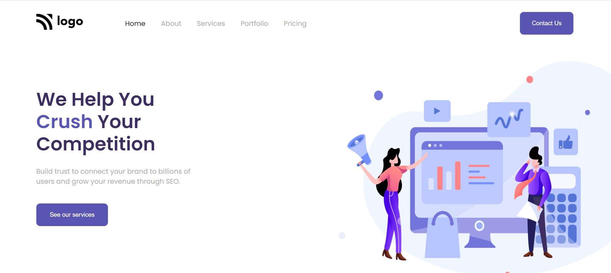

# SEO Company hero page  

This is a hero page of a company which provides the SEO services to his clients.

## 🛠 Technologies Used
---
  - HTML - Hyper Text Markup Language
  - CSS - Cascadeing Spread Sheet
  - CSS - CSS Grid, Flex Box, Positioning

## Deployed Link of the web page
---
[Click to see the webpage](https://gregarious-jelly-0a89ec.netlify.app)

## Author and Contact
---
- [Anurag katiyar](https://github.com/anuragkatiyar1994)
- anuragkatiyar1994@gmail.com 
## Time to finish the project
---

It took me around 1 hrs to finish this project.
I have learned the use case of flex and CSS Position property. 

## Feedback
---

If you have any feedback, please reach out to us at anuragkatiyar1994@gmail.com